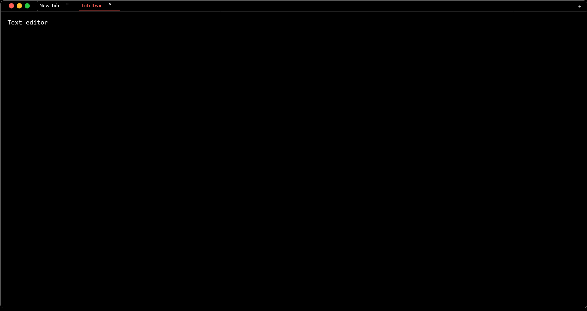

# MULTI-TAB TEXT EDITOR

- Functionality to add as many tabs as you want
- Add text in any tab and switch seamlessly
- Double-tap the tab name to rename the tab
- Dummy project to practice implementation of thoughts
- Doesn't support save functionality, just a dummy project to practice quick implementation of thoughts

## How to preview?

- Click on the link https://develover-sk.github.io/multi-tab-text-editor/ to preview.
